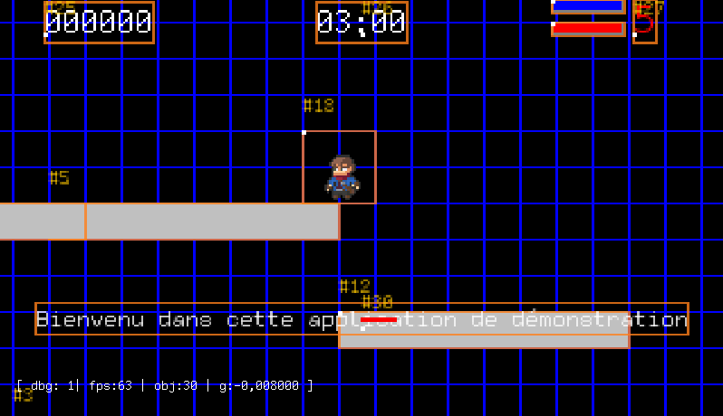

# README

A **MonoClass 2** project test.

This _small_ Java project with only one (master) class is a proof-of-concept of an over simplified java program to
deliver maximum feature in a minimum number lines of code, and WITHOUT dependencies out of the JDK itself.

A second challenge is in the no use for a build tool (maven or gradle) but nothing else than the JDK compiler tool and
the magic of a bash script (Back to Roots !).

And a last constrain is to reduce as much as possible the number of LoC, using enhancement from latest JDK.

Have fun discover this beast of code, to learn and take benefits of some latest JDK features (like
the [pattern matching for switch](https://openjdk.java.net/jeps/406 "ssee the official specification")), and moreover,
overuse of lambda and stream each time this was possible.

> :blue_book: _**NOTE**_[^1]
> _If your are curious, just visit
the "[Java Language Updates](https://docs.oracle.com/en/java/javase/18/language/java-language-changes.html "go to official source of information for Java evolution")"
page from Oracle, you will discover accross release from 9 to 18, the list of new introduced features._
>

## More Doc sir ?

See the [/docs](docs/index.md) for details

## Build

Relying an a custom build script, just execute:

```shell
$> scripts/build.sh a
```

> :blue_book: _**NOTE**_
> _for curious people, you can experiment the following command line :
> `$> build h`
> getting help in this cli build script._

This will build a jar in `target/` directory.

## Run it !

You can run it by executing the following command line :

```shell
$> scripts/build.sh r
```

(see [Build V3 README](https://gist.github.com/mcgivrer/a31510019029eba73edf5721a93c3dec#file-readme-md) for details on
build script)

Or if you build it with `scripts/build.sh a`, you will be able to run it with :

```shell
$> java --enable-preview -jar target/monoclass2-1.0.3.jar
```

You will get the following window



_figure 1 - DaGame pre-release preparing the v1.0.3 with Behavior and gameplay_

> :blue_book: _**NOTE**_
> _You can notice the new Time display, limiting the time play._

### CLI arguments

You can configure dynamically some of the internal parameters:

| Argument                | Configuration key | Description                                                                                         | Default   |
|:------------------------|:------------------|:----------------------------------------------------------------------------------------------------|:----------|
| `w`, `width`            | screenWidth       | The width of the game window                                                                        | 320       |
| `h`, `height`           | screenHeight      | The height of the game window                                                                       | 240       |
| `s`, `scale`            | displayScale      | The the pixel scale                                                                                 | 2         |
| `d`, `debug`            | debug             | the debug level of display mode                                                                     | 1         |
| `ww`, `worldwidth`      | worldWidth        | The width of the world play area                                                                    | 800       |
| `wh`, `worldheight`     | worldHeight       | The height of the world play area                                                                   | 600       |
| `wg`, `worldgravity`    | worldGravity      | The gravity in the world play area                                                                  | 0.981     |
| `spmin`                 | speedMinValue     | Physic Engine threshold object minimum speed to 0                                                   |           |
| `spmax`                 | speedMaxValue     | Physic Engine maximum object speed                                                                  |           |
| `accmin`                | accMinValue       | Physic Engine threshold object minimum acceleration to 0                                            |           |
| `accmax`                | accMaxValue       | Physic Engine maximum object acceleration                                                           |           |
| `cspmin`                | colSpeedMinValue  | Collision Detector threshold object minimum speed to 0                                              |           |
| `cspmax`                | colSpeedMaxValue  | Collision Detector maximum object speed                                                             |           |
| `fps`                   | fps               | Frame Per Second                                                                                    | 60        |
| `f`, `fullScreen`       | fullScreen        | Switch game window to fullscreen mode                                                               | false[^2] |
| `scene`                 | defaultScene      | the default scene to be activated (must be listed in the `app.scenes` in the `app.properties` file) | N/A       |
| `l`, `language`, `lang` | defaultLanguage   | select the preferred language  (existing values are en_EN, fr_FR, es_ES or de_DE).                  | en_EN     |

## Contribute

Feel free to add/edit/modify for your own usage and learn. You can fork this small project to play with.

McG. May 1st, 2022.

[^1]: Icons reference https://gist.github.com/rxaviers/7360908
[^2]: Supported boolean values to set to `true` are "1", "on", "ON", "true", "TRUE", "True", and false value are  "0", "
off", "OFF", "false", "FALSE", "False".