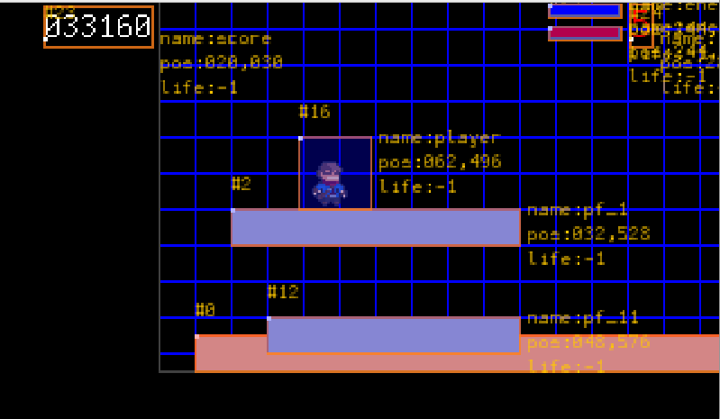

# README

A **MonoClass 2** project test.

This _small_ Java project with only one (master) class is a proof-of-concept of an over simplified java program to
deliver maximum feature in a minimum number lines of code, and WITHOUT dependencies out of the JDK itself.

A second challenge is in the no use for a build tool (maven or gradle) but nothing else than the JDK compiler tool and
the magic of a bash script (Back to Roots !).

And a last constrain is to reduce as much as possible the number of LoC, using enhancement from latest JDK.

Have fun discover this beast of code, to learn and take benefits of some latest JDK features (like
the [pattern matching for switch](https://openjdk.java.net/jeps/406 "ssee the official specification")), and moreover,
overuse of lambda and stream each time this was possible.

> :blue_book: _**NOTE**_[^1]
> _If your are curious, just visit
the "[Java Language Updates](https://docs.oracle.com/en/java/javase/18/language/java-language-changes.html "go to official source of information for Java evolution")"
page from Oracle, you will discover accross release from 9 to 18, the list of new introduced features._
>

## More Doc sir ?

See the [/docs](docs/index.md) for details

## Build

Relying an a custom build script, just execute:

```shell
$> scripts/build.sh a
```

> :blue_book: _**NOTE**_
> _for curious people, you can experiment the following command line :
> `$> build h`
> getting help in this cli build script._

This will build a jar in `target/` directory.

## Run it !

You can run it by executing the following command line :

```shell
$> scripts/build.sh r
```

(see [Vuild V3 README](https://gist.github.com/mcgivrer/a31510019029eba73edf5721a93c3dec#file-readme-md) for details on
build script)

You will get the following window



_figure 1 - Latest update preparing the v1.0.3 with Collision detection and platforms_

## Contribute

Feel free to add/edit/modify for your own usage and learn. You can fork this small project to play with.

McG. May 1st, 2022.

[^1]: Icons reference https://gist.github.com/rxaviers/7360908
