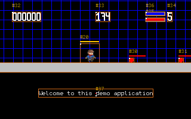

# MonoClass2, a JDK fun sample usage

By Frédéric Delorme (c) 2022

---

## Summary

1. [Introduction](01-introduction.md)
2. [A Master Class](02-master_class.md)
3. [Delegation pattern](03-delegation.md)
4. [Adding configuration](04-configuration.md)
5. [Rendering graphics elements](05-render.md)
6. [A Physic Engine ?](06-physic_engine.md)
7. [From square to Animation](07-animations.md)
8. [World collides](08-collision_detection.md)
9. [Adding Behavior to Entity](09-behaviors.md)
10. [From behavior to Game play](10-gameplay.md)
11. [Moving international](11-internationalization.md)
12. [Measure things](12-jmx_and_metrics.md)
13. [Gathering feedback](13-monitoring.md)
---
14. [The To Dos](100-todo.md)
