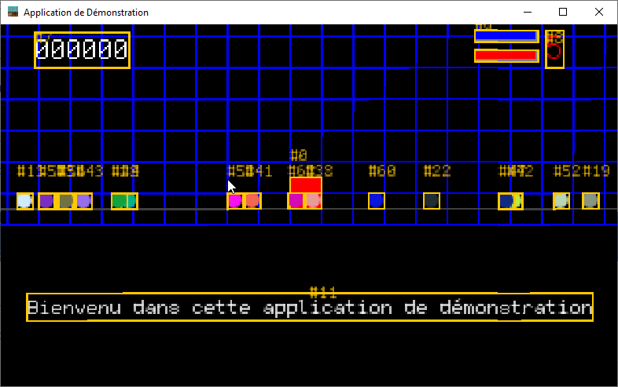

## PhysicEngine

The `Application` entities must be updated according to some physic computation formula. This is a job for
the `PhysicEngine`. Some basic physic attributes like elasticity, friction factor are used to compute acceleration,
speed and position according to some applied forces to the `Application` entities.

A small math class is added and is more a helper than a real Vector, the `Vec2d` class, to support needs for forces
computation.



_figure $fig+ - a Gravity effect !_

### A Vec2d object for 2D Vector

To gain ease of computation on forces, acceleration and speed, we will use a Vector on 2 dimension object to process
physical move math. see the `Animation.Vec2d` class for implementation details and its API.

```plantuml
class Vec2d{
    - x:double
    -y:double
    +Vec2d()
    +Vec2d(x:double,y:double)
    +add(Vec2d):Vec2d
    +add(List<Vec2d>):Vec2d
    +multiply(double):Vec2d
    +normalize():Vec2d
    +minMax(min:double,max:double)
    +setX(x:double):Vec2d
    +setY(y:double):Vec2d
    +toString():String
}
```

### The Physic Entity

The `Entity` will have 3 attributes for Newtons physics:

- `acceleration`, a `Vec2d`,
- `velocity` another `Vec2d`
- and `position` a last `Vec2d`.

But to be able to define the acceleration of any entity, we need to track the applied forces. So another attribute is
added to stack the list of force to be applied during processing

- `forces` a List of `Vec2d`

others physical characteristics are attributes:

- `width` a `double`
- `height` another `double`.

To enforce a good level of physic simulation, we will need some attributes linked to the `Entity` material. As we don't
want to go in deep in the simulation, only 2 of them will provide a good level of behavior:

- `friction` a double value as the friction of the object in case of collision,
- `elasticity`, the velocity reduction factor, a double value, to be applied to velocity in case of collision.

And as we were talking about the Newton physic computation, we need the mass of those entities:

- `mass` the mandatory mass to compute weight with gravity.


```plantuml
class Entity{
 - pos:Vec2d
 - vel:Vec2d
 - acc:Vec2d
 - width:double
 - height:double
 - forces:List<Vec2d>
 - friction:double
 - elasticity:double
 - mass:double
 +Entity(name:String)
 +update(e:double):Entity
 +toString():String
}
```

> _**NOTE**_<br/>
> _a fluent API is provided to set all the attribute's values._

### The World object

We've just introduced the gravity parameter in our physic equation. So a new object, directly linked to the world here
our entities will move in must provide some context parameters; the `World` object.

This object will have 2 attributes:

- gravity, a simple `double` value representation of gravity on the vertical axis, it's default values will be fixed to the Earth gravity (0,981
  m.s-2).
- `area` a `Rectangle.2D` shape containing the world game play space, to limit and contrains entity moves to a space
  limited area.
- and an environmental `friction`, a `double` value, to be applied to ALL entities in this `World` instance.

```plantuml
class World{
  - area:Rectangle2D
  - friction:double
  - gravity:double
  +World()
  +setArea(a:Rectangle2D):World
  +setFriction(f:double):World
  +setGravity(g:double):World
}
```