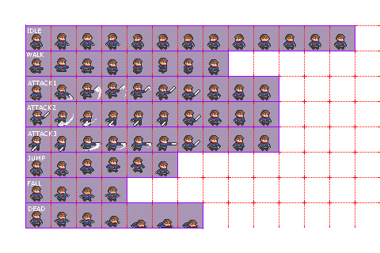

## Bring Animation

To product beautiful sprite, we need a Animation engine, let's have an Animation class, attribute for Entity, and adapt
the Render and entity update to process animations set and display a moving Sprite !

Animation is map of set of frames, each set of frame must ave a an easy way to define/identify it, a simple String key
will do the job.

> **NOTE**
> _As a sample graphics, we will use a sprites image board from [Elthen adventurer sprites](https://elthen.itch.io/pixel-art-adventurer-sprites) thanks to his [fair licensing](https://www.patreon.com/posts/27430241)._



_figure $fig+ - The sprites resources used as animation sample._

The `Entity` class will now have an animations attribute.

```plantuml
@startuml
hide methods
hide Entity attributes
class Entity
class Animation{
    - animationSet:Map
    - frameDuration:Map
    - currentAnimationSet:String
    - currentFrame:int
    - internalAnimationTime:long
}

Entity --> Animation:animations
@enduml
```

_figure $fig+ - Class diagram for Animation as animations Entity attribute_

### Animation class

The sub-class Animation will support all animation definition and operations:

```java
public static class Animation {
    Map<String, BufferedImage[]> animationSet = new HashMap<>();
    Map<String, Integer> frameDuration = new HashMap<>();
    public String currentAnimationSet;
    public int currentFrame;
    private long internalAnimationTime;
}
```

The attributes are :

- `animationSet` a map of all animation frame set, each set is an array of BufferedImage,
- `frameDuration` is a map of the corresponding duration for each frameset,
- `currentAnimationSet` is the currently active animation set key,
- `currentFrame` is the active frame for the current animation set,
- `internalAnimationTime` is an internal time counter for frame animation purpose.

And based on those attribute we will animate the frame for any entity which will have a not null animation attribute.
The `Render` class will support animation rendering in the `draw()` method, but also adding a 'direction' attribute in
the `Entity` to define the way to draw the image (left of right):

```java
public static class Render {
    //...
    public void draw(Entity e) {
        switch (e) {
            case Entity ee -> {
                switch (ee.type) {
                    //...
                    case IMAGE -> {
                        BufferedImage sprite = (BufferedImage)
                                (ee.isAnimation()
                                        ? ee.animation.getFrame()
                                        : ee.image);
                        if (ee.getDirection() > 0) {
                            g.drawImage(
                                    sprite,
                                    (int) ee.x,
                                    (int) ee.y,
                                    null);
                        } else {
                            g.drawImage(sprite,
                                    (int) (ee.x + ee.width),
                                    (int) ee.y,
                                    (int) (-ee.width),
                                    (int) ee.height,
                                    null);
                        }
                    }
                }
            }
            //...
        }
        //...
    }
    //...
}
```

The Entity will have 2 new things, an `animation` attribute and a `getDirection()` method, and the `update()` method is
slightly adapted to manage animation update:

```java
public static class Entity {
    //...
    public Animation animation;

    //...
    public int getDirection() {
        return this.dx > 0 ? 1 : -1;
    }

    //...
    public void update(double elapsed) {
        box.setRect(x, y, width, height);
        if (Optional.ofNullable(animation).isPresent()) {
            animation.update((long) elapsed);
        }
    }
    //...
} 
```

And a set of helpers are added to directly manage animation from Entity fluent API :

```java
public static class Entity {
    //...
    public Entity addAnimation(
            String key,
            int x, int y,
            int tw, int th,
            int nbFrames,
            String pathToImage) {
        if (Optional.ofNullable(this.animation).isEmpty()) {
            this.animation = new Animation();
        }
        this.animation.addAnimationSet(key, pathToImage, x, y, tw, th, nbFrames);
        return this;
    }

    public boolean isAnimation() {
        return Optional.ofNullable(this.animation).isPresent();
    }

    public Entity activateAnimation(String key) {
        animation.activate(key);
        return this;
    }

    public Entity setFrameDuration(String key, int frameDuration) {
        animation.setFrameDuration(key, frameDuration);
        return this;
    }
    //...
}
```

Then to use it in the `Application#createScene()` :

```java
import java.awt.event.KeyListener;

public class Application extends JFrame implements KeyListener {
    public void createScene() {
        //...
        Entity player = new Entity("player")
                .setType(IMAGE)
                .setSize(32.0, 32.0)
                .addAnimation("idle",
                        0, 0,
                        32, 32,
                        13,
                        "/images/sprites01.png")
                .setFrameDuration("idle", 200)
                .activateAnimation("idle");
    }
}
```

Here is added an animation set named `idle` from the image `images/sprites01.png` from the point `(0,0)` with a frame
size of `(32x32)` and having `13` frames in the set.

You can add any number of frames set with differente name to the Entity.

> **IMPORTANT**
> _Don't forget to set the Entity Size corresponding to the size of your animation set frame size._


_figure $fig+ - Animation of sprites and red life bar are some of useful things_

### Animation Refactoring to add new attributes

NOW we have a smooth animation mechanism, we can enhance it by adding new feature, bringing more thin control over
animations frames and a loop capability with a max number of repetition (or infinite one).

To perform such thing, the frame duration must be added, and frames/animation set will be split into `AnimationSet`, a
new class to store frames, there duration and the loop attributes with its value:

- 0 no looping,
- 1-n looping with a number of time
- -1 is an infinite looping.

This new object `AnimationSet` will be:

```java
public static class AnimationSet {
    private String name;
    private BufferedImage[] frames;
    private int[] duration;
    private int loop;
}
```

And the `Animation` class becomes :

```java
public static class Animation {
    private Map<String, AnimationSet> animations;
    public String currentAnimationSet;
    public int currentFrame;
    private long internalAnimationTime;
}
```

Now we will need to adapt the Animation fluent API and the Entity helpers methods.

```java
public static class Animation {
    //...
    public Animation addAnimationSet(String key, String imgSrc, int x, int y, int tw, int th, int[] durations, int loop) {
        try {
            AnimationSet aSet = new AnimationSet(key).setSize(tw, th);
            BufferedImage image = ImageIO.read(Objects.requireNonNull(this.getClass().getResourceAsStream(imgSrc)));
            BufferedImage[] buffer = new BufferedImage[nbFrames];
            for (int i = 0; i < nbFrames; i++) {
                BufferedImage frame = image.getSubimage(x + (i * tw), y, tw, th);
                aSet.frames[i] = frame;
            }
            aSet.setFramesDuration(durations);
            aSet.setLoop(loop);
            animations.put(key, aSet);
        } catch (IOException e) {
            System.out.println("ERR: unable to read image from '" + imgSrc + "'");
        }
        return this;
    }
    //...

}
```

- activate an animation set:

```java
public static class Animation {
    //...
    public Animation activate(String key) {
        this.currentAnimationSet = key;
        if (currentFrame > this.animationSet.get(key).frames.length) {
            this.currentFrame = 0;
            this.internalAnimationTime = 0;
        }
        return this;
    }
    //...
}
```

- update the current animation

```java
public static class Animation {
    //...
    public synchronized void update(long elapsedTime) {
        internalAnimationTime += elapsedTime;
        AnimationSet aSet = animationSet.get(currentAnimationSet);
        if (internalAnimationTime > aSet.durations[currentFrame]) {
            internalAnimationTime = 0;
            currentFrame = currentFrame + 1 < aSet.frames.length 
                    ? currentFrame + 1 
                    : (aSet.loop == -1 || currentFrame < aSet.loop ? 0 : currentFrame);
        }
    }
    //...
}
```

- retrieve the current frame

```java
public static class Animation {
    //...
    public synchronized BufferedImage getFrame() {
        if (animationSet.get(currentAnimationSet) != null
                && currentFrame < animationSet.get(currentAnimationSet).frames.length) {
            return animationSet.get(currentAnimationSet).frames[currentFrame];
        }
        return null;
    }
    //...
}
```
