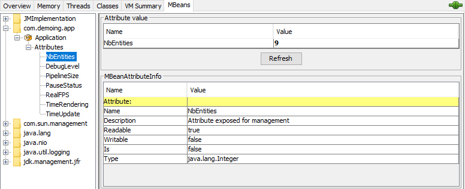
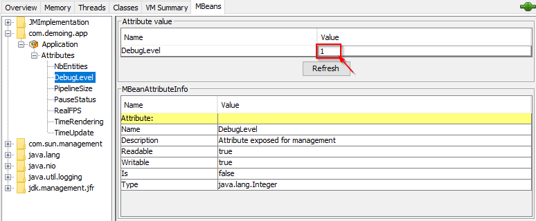

## JMX metrics

It's easy to add remote readable metrics with the builtin Java feature JMX.

First create a simple bean (a MBean in the java jargon) which will contain all the metric you want to expose:

```java
public interface AppStatusMBean {
    // actuators
    Integer getDebugLevel();

    void setDebugLevel(Integer d);

    Boolean getPauseStatus();

    void setPauseStatus(Boolean pause);

    // counters
    Integer getNbEntities();

    Integer getPipelineSize();

    Long getRealFPS();

    // times
    Long getTimeRendering();

    Long getTimeUpdate();
}
```

In this bean exists 3 types of metrics:

- some metrics than can be interactively changed like `debugLevel` and `pauseStatus`,
- some that are simple counters like `nbEntities` or `pipelineSize`,
- and some that are time measures as `timeRendering` or `timeUpdate`  (in nanosecond/ns)

In the Application class, we will have to add a new implementation of this MBean, it must have all the internal
attributes to be exposed:

```java
public class AppStatus implements AppStatusMBean {
    private int debugLevel;
    private int nbEntities, pipelineSize;
    boolean pauseStatus;
    private long realFPS, timeRendering, timeUpdate;
    private String programName;
}
```

And to connect this MBean to the java internal server to expose those values, we will need to register it:

```java
public class AppStatus implements AppStatusMBean {
    //...
    public void register(Application app) {
        try {
            // Register the object in the MBeanServer
            MBeanServer platformMBeanServer = ManagementFactory.getPlatformMBeanServer();
            ObjectName objectName = new ObjectName("com.demoing.app:name=" + programName);
            platformMBeanServer.registerMBean(this, objectName);
        } catch (InstanceAlreadyExistsException
                | MBeanRegistrationException
                | NotCompliantMBeanException
                | MalformedObjectNameException e) {
            e.printStackTrace();
        }
    }
    //...
}
```

And to update this attributes, an update method :

```java
public class AppStatus implements AppStatusMBean {
    //...
    public synchronized void update(Application app) {
        nbEntities = app.entities.size();
        realFPS = app.realFps;
        pipelineSize = app.render.gPipeline.size();
        timeRendering = app.render.renderingTime;
        timeUpdate = app.physicEngine.updateTime;
        pauseStatus = app.pause;
        debugLevel = app.config.debug;
    }
    //...
}
```

And do not forget to add all the needed getters/setters, here are just some examples:

```java
public class AppStatus implements AppStatusMBean {
    //...
    @Override
    public synchronized Integer getDebugLevel() {
        return debugLevel;
    }

    @Override
    public synchronized void setDebugLevel(Integer d) {
        config.debug = d;
    }

    //...
    @Override
    public synchronized Long getTimeRendering() {
        return timeRendering;
    }
    //...
}
```

And in the Application class:

```java
public class Application {
    //...
    private AppStatus appStats;

    //...
    private void initialize(String[] args) {
        //...
        createJMXStatus(this);
    }

    private void createJMXStatus(Application application) {
        appStats = new AppStatus(application, "Application");
        appStats.register(application);
    }

}
```

And now, starting the Application, you can directly connect the JCOnsole to the newly showed java process:


You can accept the insécure connection to the process:


You will get basic informtion for your process:


And finally the created metrics in the MBean tab:



And the debug attribute value can be dynamically changed :



