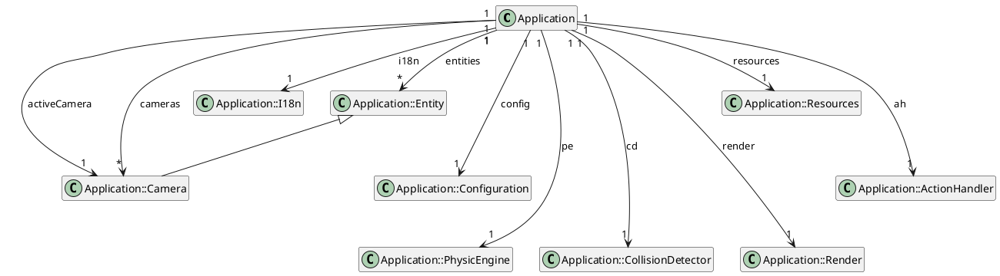

# A master Application

The main class (and the jar entrypoint) is composed of some feature centric attributes like:

- `entites` which is a map of `Entity` managed by the program,
- `gPipeline` is the list of entities to be rendered to screen.
- `activeCamera` is the possible `Camera` to see through to focus a specific target `Entity`.

A bunch of methods are for internal initialization and processing only:

- `initialize()`, `loadConfig()`, `parseArg()`, `parseDouble()`, `parseInt()` to start the app, load configuration and
  parse agrs
- `run()`, `loop()`, `update()`, to execute the main loop,
- `updateEntity`, `applyPhysicRuleToEntity`, `ContrainEntity()`, `constrainToWorld()` to update and compute entities
  moves, physics and constrains,
- `draw()`, `renderToScreen()`,`moveCamera()` to process rendering pipeline.

And some methods that can be adapted:

- `loadConfig()` to define some configurable parameters from the `app.propertties` file,
- `parseArg()` to override configuration with CLI arguments values,
- `createScene()` to define the game scene with `Entity` and `Camera`,
- `input()` to process key input for game interaction.

And some utilities / helpers:

- `addEntity()` to add an `Entity` to the application,
- `addCamera()` to define the active Camera, if one must be added (optional).

## Entity

All objects managed by the `Application` (the game!) must be clearly identified and defined.
The `Entity` is the class we will implement to satisfy to all the requirements for a game object. But what is a game
object ?

- A game object must move all over the screen,
- it can be a geometrical shape or an animated image,
- it has a specific size,
- it can collide with another game object,
- it can support some draw color,
- It can be rendered by the application, but in a certain sort order,
- It can have some child objects,

Certains other thing will come later.

Starting with that, we can provide some attributes to our `Entity` object:

```java
public class Entity {
    // position
    private Vec2d pos;
    // velocity
    private Vec2d vel;
    // acceleration
    private Vec2d acc;
    // size
    private double width, height;
    // rendering priority
    private int priority;
    // draw color 
    private Color color;
    // fill color
    private fillColor color;
    // image if image 
    private BufferedImage image;
    // Type of entity
    private EntityType type;
}
```

We will understand the existing attributes like `pos`, `vel` and `acc` that will be used to compute some physic around,
`width` and `height`, `color` and `fillColor`, and `image` are crystal clear,
The `type` is a bit complex, and need some explanation. It is used to define the rendering process for this entity.
We will see soon how it is used by the class `Render`.

## EntityType

Here is a specific enum to define the type of entity. We talk about some geometrical shapes or image:

```java
public enum EntityType {
    RECTANGLE,  // A rectangle
    ELLIPSE,    // an ellipse
    IMAGE,      // an image
    NONE;       // none of this !
}
```

## Camera

And yes, to be able to show things, we need something to "see" or "look at" the main object of the `Application`,
certainly the "player". So we will need to focus on a specific object, a `target`.

```java
public class Camera extends Entity {
    private Entity target;
}
```

## And now, what next ?

Let's make the partition for that music ;)



_figure 1 - Class Diagram for Application and its
subclasses_ <kbd>[edit](https://github.com/mcgivrer/monoclass2/blob/feature/add-camera-entity/docs/class-diagram.txt)</kbd>

Ok, and in the code, it may take this shape :

```java
public class Application extends JPanel implements KeyListener {

    protected void run() {
        if (start()) {
            loop();
            dispose();
        }
    }

    private boolean start() {
        // ...
        return true; // or false 
    }

    private void loop() {
        long timeFrame = 0, frames = 0;
        long previous = System.currentTimeMillis();
        while (!exit) {

            long start = System.currentTimeMillis();
            double elapsed = start - previous;

            // Compute and process everything !
            input();
            update(elapsed);
            render();

            // wait at least 1ms.
            computationTime = System.currentTimeMillis() - start;
            long waitTime = (config.frameTime > computationTime)
                    ? config.frameTime - (long) computationTime
                    : 1;

            timeFrame += elapsed;
            frames += 1;
            if (timeFrame > 1000) {
                timeFrame = 0;
                realFps = frames;
                frames = 0;
            }
            try {
                Thread.sleep(waitTime);
            } catch (InterruptedException ie) {
                Logger.log(Logger.ERROR, this.getClass(),
                        "ERR: Unable to wait for %d : %s"
                        , waitTime
                        , ie.getLocalizedMessage());
            }

            previous = start;
        }
    }

    public void dispose() {
        //...
    }

    private void input() {
        //...
    }

    private synchronized void update(double elapsed) {
        //...
    }

    private void render() {
        //...
    }

    //-------------------------------------------------------
    // other methods from the KeyListener interface
    //-------------------------------------------------------

    // A famous main java entry point
    public static void main(String[] args) {
        try {
            Application app = new Application(args);
            app.run();
        } catch (Exception e) {
            Logger.log(Logger.ERROR, Application.class,
                    "ERR: Unable to run application: %s",
                    e.getLocalizedMessage());
            e.printStackTrace();
        }
    }

}
```

### Application class

The `Application` extends
the [`JPanel`](https://docs.oracle.com/en/java/javase/18/docs/api/java.desktop/javax/swing/JPanel.html) to have a change
to display something through the good old AWT/Swing java API.
It also implements
the [`KeyListener`](https://docs.oracle.com/en/java/javase/18/docs/api/java.desktop/java/awt/event/KeyListener.html)
interface to let the `Application` capture key events.

So you will find a `keyPressed()`, `keyReleased()` and `keyTyped()` implementation to satisfy the API, but we won't
detail those here.

But let go in details into important class methods.

### run

The run is the starting point of our Application.

```java
public class Application extends JPanel implements KeyListener {
    protected void run() {
        if (start()) {
            loop();
            dispose();
        }
    }
}
```

### start

So the first thing is, as any program, initialization. And the `Application` is not different:

```java
public class Application extends JPanel implements KeyListener {
    private boolean start() {
        // ...
        return true; // or false 
    }
}
```

In this `start`, all the needed object, service and variables can be initialized.

### Loop

The most important in a game is the LOOP !  Where all is happening and where all is processed.

```java
public class Application extends JPanel implements KeyListener {

    private void loop() {
        long timeFrame = 0, frames = 0;
        long previous = System.currentTimeMillis();
        while (!exit) {

            long start = System.currentTimeMillis();
            double elapsed = start - previous;

            // Compute and process everything !
            input();
            update(elapsed);
            render();

            // wait at least 1ms.
            computationTime = System.currentTimeMillis() - start;
            long waitTime = (config.frameTime > computationTime) ? config.frameTime - (long) computationTime : 1;

            timeFrame += elapsed;
            frames += 1;
            if (timeFrame > 1000) {
                timeFrame = 0;
                realFps = frames;
                frames = 0;
            }
            try {
                Thread.sleep(waitTime);
            } catch (InterruptedException ie) {
                Logger.log(Logger.ERROR, this.getClass(), "ERR: Unable to wait for " + waitTime + ": " + ie.getLocalizedMessage());
            }

            previous = start;
        }
    }
}
```

Most of the lines are some elapsed time computation.

### start