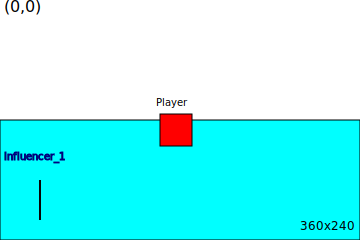

# World's Influencer

## Context

The World object describes the environment into all the Entity will evolve, through the rules of PhysicEngine.




The Influencer entity will let entity to be temporarily changed in its attributes, changing forces, friction,
elasticity, color, speed, acceleration, gravity.

The World object will support a map of Influencer, and the PhysicEngine, will apply the Influence attributes changes to
the Entity under Influence.

This would be used to simulate water, wind, magnet, Ice, or anything that can influence any Entity's physical or
graphical attributes.

## Influencer entity

The `Influencer` will take benefit of all already existing `Entity` attribute to support `Influencer`'s goals:
Change the `Entity` contained in the area defined by the Influencer position and size, and the attributes will support
the `attributes` to be applied to these contained entities. Attributes will be changed by a nen entity named Material (see bellow).

```java 
public class Influencer extends Entity {
    
    public Material material;
    
    public Influencer(String name){
        super(name);
    }
    //...
}
```

## Material

To easily adapt any `Entity` in a `Influencer`'s zone, we need a way to define physic attributes atomic object that can
be reused and adapted.

Here we will introduce the `Material` object.

It's a java class having the mandatory physic attribtues like `elasticity`, `densit` and `friction` values, and some
graphical attribute as `color` and `transparency` values.

```java
public class Material {
    //---- physic attributes
    public double elasticity;
    public double friction;
    public double density;
    // ---- graphic attributes
    public Color color;
    public float transparency;
}
```
## World

The `World` object now must support a default `Material` to define environmental constrains.

```java
public static class World {
    public double gravity = 0.981;
    public Rectangle2D area;
    public Material material;
    
    public Material setMaterial(Material m){
      this.material = m;
      return this;
    }
    public getMaterial(){
      return material;
    }
}
```

## PhysicEngine and Render adaptation.

The `Influencer` can be added to the `Applicaiton` entities Map.

- The `Render` processing is now adpated to display specifically the `Influencer` like an `Entity`.
- The `PhysicEngine` is updated to detect when an Entity is "influcend" by an Influencer, if that the casen the `Material` defined in the `Influencer` is temporarily applied in place of the one of the Entity in the physic computation. So `density`, `friction` or `elasticity` can be changed in the `Influencer`'s influence area :P

### Render

The new draw method will take care of the `Influencer` entity:

```java
public class Render
    //...
    public void draw(long realFps) {
        //...
        gPipeline.stream()
            .filter(e -> !(e instanceof Light)
                    && e.isAlive() || e.isPersistent())
            .forEach(e -> {
                if (e.isNotStickToCamera()) {
                    moveCamera(g, activeCamera, -1);
                }
                g.setColor(e.color);
                switch (e) {
                    //...
                    // This is an Influencer
                    case Influencer ie -> {
                        drawInfluencer(g, ie);
                    }
                    //...
                }
                //...
        });
    }
    //...
}
```

### PhysicEngine

```java
public class PhysicEngine {
    //...
    public Map<String, Influencer> getInfluencers() {
        return app.entities.values()
                .stream()
                .filter(e -> e instanceof Influencer)
                .collect(Collectors.toMap(e -> e.name, e -> (Influencer) e));
    }
    //...
    private Material applyWorldInfluencers(Entity e) {
        Material m = e.material;
        getInfluencers().values()
            .stream()
            .filter(i -> i.box.contains(e.box))
            .forEach(i2 -> {
                m = i2.material;
                e.forces.add(i1.force);
            });
        return m;
    }
    //...
    
    private void applyPhysicRuleToEntity(Entity e, double elapsed) {
        e.oldPos.x = e.pos.x;
        e.oldPos.y = e.pos.y;

        // a small reduction of time
        elapsed *= 0.4;

        Material m = applyWorldInfluencers(e);
        e.acc = new Vec2d(0.0, 0.0);
        e.acc.add(e.forces);

        e.vel.add(e.acc
                .minMax(config.accMinValue, config.accMaxValue)
                .multiply(0.5 * elapsed * e.material.friction * world.friction));
        e.vel.minMax(config.speedMinValue, config.speedMaxValue);

        e.pos.add(e.vel);

        e.forces.clear();
    }
    
}
```
