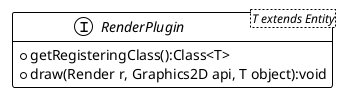
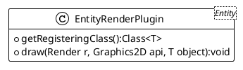
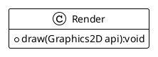

# Adding plugin to Render

As we add new `Entity` type, we need to update the `Render` class. but the specificities for some `Entity` is not
the `Render` responsibility,
but the developer of the new `Entity` inherited implementation responsibility.

So let's propose a new approach to satisfy this new requirement, by delegating the rendering of entities to some
specialized `RenderPlugin`.

## The RenderPlugin interface



## Proposed plugin mechanism implementation

TODO



## Render with plugin approach



Here is an implementation proposition for the main `Render#draw(long)` method:

```java
import java.util.concurrent.ConcurrentHashMap;

public class Render {
    //...
    private Map<Class<? extends entity>, RenderPlugin> plugins = new ConcurrentHashMap<>();

    //...
    public void draw(long realFps) {
        long startTime = System.nanoTime();
        Graphics2D g = buffer.createGraphics();
        //...
        gPipeline.stream()
                .filter(e -> !e.getClass().equals(Light.class)
                        && e.isAlive() || e.isPersistent())
                .forEach(e -> {
                    drawEntity(g, e);
                });
        g.dispose();
        //...
    }
}
```

And the most interesting part, the `Render#drawEntity(Graphics2D,Entity)` over-simplified implementation :

```java
import java.util.logging.Level;

public class Render {
    //...
    private void drawEntity(Graphics2D g, Entity e) {
        if (e.isNotStickToCamera()) {
            moveCamera(g, activeCamera, -1);
        }
        if (plugins.containsKey(e.getClass())) {
            plugins.get(e.getClass()).draw(this, g, e);
        } else {
            Logger.log(
                Logger.ERROR, 
                this.getClass(), 
                "No RenderPlugin implementation found for %s.",
                e.getClass().toString());
        }
        drawDebugInfo(g, e);
        if (e.isNotStickToCamera()) {
            moveCamera(g, activeCamera, 1);
        }
        // Draw all child entities.
        e.getChild().forEach(ce -> drawEntity(g, ce));
    }
    //...
}
```

## Implementing required plugins

TODO
