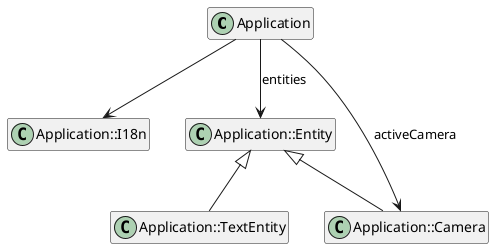
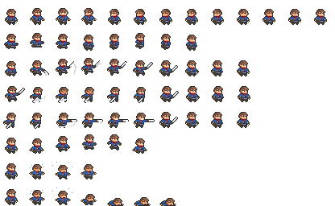
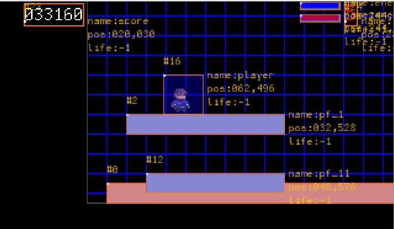
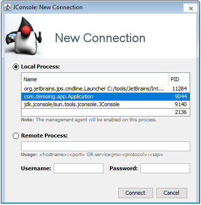
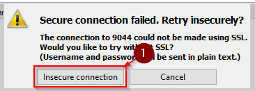
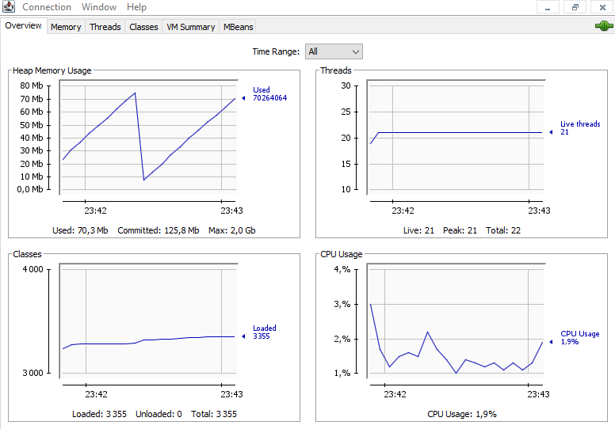
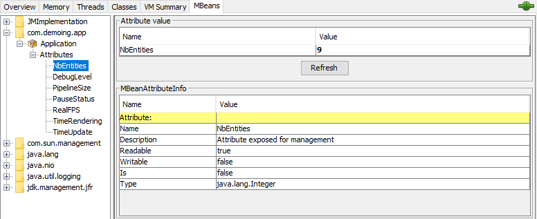
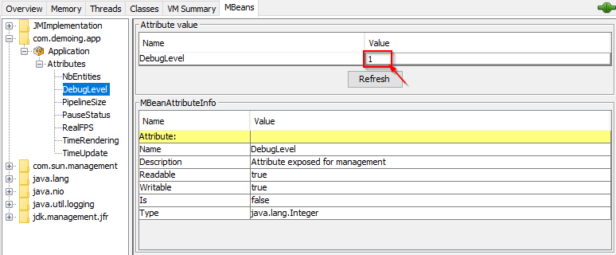

## Introduction

A bunch of discovery on the Java JDK latest release into a fun and entertaining sample of code. Let's discover the
JEP420 Pattern Matching `switch`, `@FunctionalInterface` and some enhancement on the
`[List/Map].of()` constructors.

## The project

The [`Application`](https://github.com/mcgivrer/monoclass2/blob/feature/add-camera-entity/src/main/java/com/demoing/app/Application.java#L17)
class (we can not talk about a project for a 1500 LoCs class) is composed of some attribtues and methods (sic) and a
limited number of subclasses.



_figure $fig+ - Class Diagram for Application and its
subclasses_ _[edit](https://github.com/mcgivrer/monoclass2/blob/feature/add-camera-entity/docs/class-diagram.txt)_

So, [`I18n`](https://github.com/mcgivrer/monoclass2/blob/feature/add-camera-entity/src/main/java/com/demoing/app/Application.java#L69)
, `Entity`, `TextEntity` and `Camera` are subclasses of `Application` master class, if you does not understand :P.

## A master Application

The main class (and the jar entrypoint) is composed of some feature centric attributes like:

- `entites` which is a map of `Entity` managed by the program,
- `gPipeline` is the list of entities to be rendered to screen.
- `activeCamera` is the possible `Camera` to see through to focus a specific target `Entity`.

A bunch of methods are for internal initialization and processing only:

- `initialize()`, `loadConfig()`, `parseArg()`, `parseDouble()`, `parseInt()` to start the app, load configuration and
  parse agrs
- `run()`, `loop()`, `update()`, to execute the main loop,
- `updateEntity`, `applyPhysicRuleToEntity`, `ContrainEntity()`, `constrainToWorld()` to update and compute entities
  moves, physics and constrains,
- `draw()`, `renderToScreen()`,`moveCamera()` to process rendering pipeline.

And some methods that can be adapted:

- `loadConfig()` to define some configuratble parameters from the `app.propertties` file,
- `parseArg()` to override configuration with CLI arguments values,
- `createScene()` to define the game scene with `Entity` and `Camera`,
- `input()` to process key input for game interaction.

And some utilities / helpers:

- `addEntity()` to add an `Entity` to the application,
- `addCamera()` to define the active Camera, if one must be added (optional).

## Delegation pattern

The application based on the one master class, have some sub objects as models, and some as services. To keep it simple
and light, the `Application` class contains the main mechanic. `I18n` provide helpers for translation, while `Entity`,
`Vec2D`, `Camera` are objects to support main activities and are more data oriented.

The configuration operation would be moved to a dedicated object (maybe in a second step), and also the _update_ and
_draw_ operations could be delegated to sub-objects.

```plantuml
@startuml

hide Application methods
hide Application attributes
class Application

hide Entity methods
hide Entity attributes
class Entity

hide Configuration attributes
class Configuration{
 +parseArgs(args:String[])
}
hide Render attributes
class Render{
 +draw(fps:double)
 +addToPipeline(e:Entity)
}
hide PhysicEngine attributes
class PhysicEngine{
 +update(elapsed:double)
}
hide I18n attributes
class I18n{
 + get(key:String)
 + get(key:String,...Object)
}

Application --> Entity:entities
Application --> Configuration:configuration
Application --> Render:render
Application --> PhysicEngine:physicEngine
Application -> I18n
@enduml
```

_figure $fig+ - the full Application class diagram_

### Configuration

The `Configuration` class will provide attributes and their default values from a configuration properties file. It is
also possible to parse the command line argument to extract on the fly configuration value to the `Application`.

### Render

All draw operations are delegated to the `Render` class to order, draw and update some pipeline's `Entity` attributes.

### PhysicEngine

The `Application` entities must be updated according to some physic computation formula. This is a job for
the `PhysicEngine`. Some basic physic attributes like elasticity, friction factor are used to compute acceleration,
speed and position according to some applied forces to the `Application` entities.

A small math class is added and is more a helper than a real Vector, the `Vec2d` class, to support needs for forces
computation.


_figure $fig+ - a Gravity effect !_

## Render and JDK 17-18 advantages

Mosty in all services and processing class, I'll be using the latest Lambdas possibilities and the JEP-420 preview from
JDK17 and 18, the Pattern Matching Switch Capability, For rendering purpose, adapting the `Render#draw` method the the
type of Entity in the pipeline.

```java
class Render {
    public draw(double fps) {
        gPipeline.stream()
                .filter(e -> e.isAlive() || e.isNeverDying())
                .forEach(e -> {
                    //...
                    switch (e) {
                        case TextEntity te -> {
                            // draw Text entity
                        }
                        case Entity ee -> {
                            // draw a standard Entity
                        }
                    }
                    //...
                });
    }
}
```

And in the Entity draw operation, the rendering process is adapted to the enum type of Entity:

```java
class Render {
    //...
    public void draw(double fps) {
        //...
        switch (e) {
            //...
            case Entity ee -> {
                // draw a standard Entity
                switch (ee.type) {
                    case RECTANGLE -> {
                        g.fillRect((int) ee.x, (int) ee.y, (int) ee.width, (int) ee.height);
                    }
                    case ELLIPSE -> {
                        g.fillArc((int) ee.x, (int) ee.y, (int) ee.width, (int) ee.height, 0, 360);
                    }
                    case IMAGE -> {
                        g.drawImage(ee.image, (int) ee.x, (int) ee.y, null);
                    }
                }
            }
        }
        //...
    }
    //...
}
```

## Bring Animation

To product beautiful sprite, we need a Animation engine, let's have an Animation class, attribute for Entity, and adapt
the Render and entity update to process animations set and display a moving Sprite !

Animation is map of set of frames, each set of frame must ave a an easy way to define/identify it, a simple String key
will do the job.

> **NOTE**
> _As a sample graphics, we will use a sprites image board from [Elthen adventurer sprites](https://elthen.itch.io/pixel-art-adventurer-sprites) thanks to his [fair licensing](https://www.patreon.com/posts/27430241)._



_figure $fig+ - The sprites resources used as animation sample._

The `Entity` class will now have an animations attribute.

```plantuml
@startuml
hide methods
hide Entity attributes
class Entity
class Animation{
    - animationSet:Map
    - frameDuration:Map
    - currentAnimationSet:String
    - currentFrame:int
    - internalAnimationTime:long
}

Entity --> Animation:animations
@enduml
```

_figure $fig+ - Class diagram for Animation as animations Entity attribute_

### Animation class

The sub-class Animation will support all animation definition and operations:

```java
public static class Animation {
    Map<String, BufferedImage[]> animationSet = new HashMap<>();
    Map<String, Integer> frameDuration = new HashMap<>();
    public String currentAnimationSet;
    public int currentFrame;
    private long internalAnimationTime;
}
```

The attributes are :

- `animationSet` a map of all animation frame set, each set is an array of BufferedImage,
- `frameDuration` is a map of the corresponding duration for each frameset,
- `currentAnimationSet` is the currently active animation set key,
- `currentFrame` is the active frame for the current animation set,
- `internalAnimationTime` is an internal time counter for frame animation purpose.

And based on those attribute we will animate the frame for any entity which will have a not null animation attribute.
The `Render` class will support animation rendering in the `draw()` method, but also adding a 'direction' attribute in
the `Entity` to define the way to draw the image (left of right):

```java
public static class Render {
    //...
    public void draw(Entity e) {
        switch (e) {
            case Entity ee -> {
                switch (ee.type) {
                    //...
                    case IMAGE -> {
                        BufferedImage sprite = (BufferedImage)
                                (ee.isAnimation()
                                        ? ee.animation.getFrame()
                                        : ee.image);
                        if (ee.getDirection() > 0) {
                            g.drawImage(
                                    sprite,
                                    (int) ee.x,
                                    (int) ee.y,
                                    null);
                        } else {
                            g.drawImage(sprite,
                                    (int) (ee.x + ee.width),
                                    (int) ee.y,
                                    (int) (-ee.width),
                                    (int) ee.height,
                                    null);
                        }
                    }
                }
            }
            //...
        }
        //...
    }
    //...
}
```

The Entity will have 2 new things, an `animation` attribute and a `getDirection()` method, and the `update()` method is
slightly adapted to manage animation update:

```java
public static class Entity {
    //...
    public Animation animation;

    //...
    public int getDirection() {
        return this.dx > 0 ? 1 : -1;
    }

    //...
    public void update(double elapsed) {
        box.setRect(x, y, width, height);
        if (Optional.ofNullable(animation).isPresent()) {
            animation.update((long) elapsed);
        }
    }
    //...
} 
```

And a set of helpers are added to directly manage animation from Entity fluent API :

```java
public static class Entity {
    //...
    public Entity addAnimation(
            String key,
            int x, int y,
            int tw, int th,
            int nbFrames,
            String pathToImage) {
        if (Optional.ofNullable(this.animation).isEmpty()) {
            this.animation = new Animation();
        }
        this.animation.addAnimationSet(key, pathToImage, x, y, tw, th, nbFrames);
        return this;
    }

    public boolean isAnimation() {
        return Optional.ofNullable(this.animation).isPresent();
    }

    public Entity activateAnimation(String key) {
        animation.activate(key);
        return this;
    }

    public Entity setFrameDuration(String key, int frameDuration) {
        animation.setFrameDuration(key, frameDuration);
        return this;
    }
    //...
}
```

Then to use it in the `Application#createScene()` :

```java
import java.awt.event.KeyListener;

public class Application extends JFrame implements KeyListener {
    public void createScene() {
        //...
        Entity player = new Entity("player")
                .setType(IMAGE)
                .setSize(32.0, 32.0)
                .addAnimation("idle",
                        0, 0,
                        32, 32,
                        13,
                        "/images/sprites01.png")
                .setFrameDuration("idle", 200)
                .activateAnimation("idle");
    }
}
```

Here is added an animation set named `idle` from the image `images/sprites01.png` from the point `(0,0)` with a frame
size of `(32x32)` and having `13` frames in the set.

You can add any number of frames set with differente name to the Entity.

> **IMPORTANT**
> _Don't forget to set the Entity Size corresponding to the size of your animation set frame size._


_figure $fig+ - Animation of sprites and red life bar are some of useful things_

### Animation Refactoring to add new attributes

NOW we have a smooth animation mechanism, we can enhance it by adding new feature, bringing more thin control over
animations frames and a loop capability with a max number of repetition (or infinite one).

To perform such thing, the frame duration must be added, and frames/animation set will be split into `AnimationSet`, a
new class to store frames, there duration and the loop attributes with its value:

- 0 no looping,
- 1-n looping with a number of time
- -1 is an infinite looping.

This new object `AnimationSet` will be:

```java
public static class AnimationSet {
    private String name;
    private BufferedImage[] frames;
    private int[] duration;
    private int loop;
}
```

And the `Animation` class becomes :

```java
public static class Animation {
    private Map<String, AnimationSet> animations;
    public String currentAnimationSet;
    public int currentFrame;
    private long internalAnimationTime;
}
```

Now we will need to adapt the Animation fluent API and the Entity helpers methods.

```java
public static class Animation {
    //...
    public Animation addAnimationSet(String key, String imgSrc, int x, int y, int tw, int th, int[] durations, int loop) {
        try {
            AnimationSet aSet = new AnimationSet(key).setSize(tw, th);
            BufferedImage image = ImageIO.read(Objects.requireNonNull(this.getClass().getResourceAsStream(imgSrc)));
            BufferedImage[] buffer = new BufferedImage[nbFrames];
            for (int i = 0; i < nbFrames; i++) {
                BufferedImage frame = image.getSubimage(x + (i * tw), y, tw, th);
                aSet.frames[i] = frame;
            }
            aSet.setFramesDuration(durations);
            aSet.setLoop(loop);
            animations.put(key, aSet);
        } catch (IOException e) {
            System.out.println("ERR: unable to read image from '" + imgSrc + "'");
        }
        return this;
    }
    //...

}
```

- activate an animation set:

```java
public static class Animation {
    //...
    public Animation activate(String key) {
        this.currentAnimationSet = key;
        if (currentFrame > this.animationSet.get(key).frames.length) {
            this.currentFrame = 0;
            this.internalAnimationTime = 0;
        }
        return this;
    }
    //...
}
```

- update the current animation

```java
public static class Animation {
    //...
    public synchronized void update(long elapsedTime) {
        internalAnimationTime += elapsedTime;
        AnimationSet aSet = animationSet.get(currentAnimationSet);
        if (internalAnimationTime > aSet.durations[currentFrame]) {
            internalAnimationTime = 0;
            currentFrame = currentFrame + 1 < aSet.frames.length 
                    ? currentFrame + 1 
                    : (aSet.loop == -1 || currentFrame < aSet.loop ? 0 : currentFrame);
        }
    }
    //...
}
```

- retrieve the current frame

```java
public static class Animation {
    //...
    public synchronized BufferedImage getFrame() {
        if (animationSet.get(currentAnimationSet) != null
                && currentFrame < animationSet.get(currentAnimationSet).frames.length) {
            return animationSet.get(currentAnimationSet).frames[currentFrame];
        }
        return null;
    }
    //...
}
```

## Collision Detection

Collision Detection has 2 possibilities : 2 dynamic object are colliding, or a dynamic and sa static object are
colliding. These are the 2 cases we will process in our `CollisionDetector` service.

We need to use carefully the PhysicType with STATIC and DYNAMIC values.

```java
public enum PhysicType {
    DYNAMIC,
    STATIC
}
```

### Updating Entity

The Entity already take benefits of this type for the physicEngine computation. Now we will reuse it into the collision
detection and resolution.

The implementation for colliding object will be based on the `Shape` variant object `Rectangle2D` and `Ellipse2D`
from the `java.awt.geom` package.

We need to add a new collision box (cbox) which will be accordingly to the ObjectType a Rectangle2D or an Ellipse2D:

```java
public static class Entity {
    //...
    public Entity setSize(double w, double h) {
        this.width = w;
        this.height = h;
        box.setRect(x, y, w, h);
        setCollisionBox(0, 0, 0, 0);
        return this;
    }

    //...
    public Entity setCollisionBox(double left, double top, double right, double bottom) {
        switch (type) {
            case IMAGE, RECTANGLE, default -> this.bbox = new Rectangle2D.Double(left, top, right, bottom);
            case ELLIPSE -> this.bbox = new Ellipse2D.Double(left, top, right, bottom);
        }
        update(0.0);
        return this;
    }

    //...
    public void update(double elapsed) {
        //...
        switch (type) {
            case RECTANGLE, IMAGE, default -> cbox = new Rectangle2D.Double(
                    box.getX() + bbox.getBounds().getX(),
                    box.getY() + bbox.getBounds().getY(),
                    box.getWidth() - (bbox.getBounds().getWidth() + bbox.getBounds().getX()),
                    box.getHeight() - (bbox.getBounds().getHeight() + bbox.getBounds().getY()));
            case ELLIPSE -> cbox = new Ellipse2D.Double(
                    box.getX() + bbox.getBounds().getX(),
                    box.getY() + bbox.getBounds().getY(),
                    box.getWidth() - (bbox.getBounds().getWidth() + bbox.getBounds().getX()),
                    box.getHeight() - (bbox.getBounds().getHeight() + bbox.getBounds().getY()));
        }
        //...
    }
}
```

### Collision Detector

Ok, now the fun part with the collision detection :

```java
public static class CollisionDetector {
    //...
    private void detect() {
        List<Entity> targets = colliders.values()
                .stream()
                .filter(e -> e.isAlive() || e.isNeverDying())
                .toList();
        for (Entity e1 : colliders.values()) {
            e1.collide = false;
            for (Entity e2 : targets) {
                e2.collide = false;
                if (e1.id != e2.id && e1.cbox.getBounds().intersects(e2.cbox.getBounds())) {
                    resolve(e1, e2);
                }
            }
        }
    }
    //...
}
```

As soon a collision is detected, we try and solve it :

```java
public static class CollisionDetector {
    //...
    private void resolve(Entity e1, Entity e2) {
        e1.collide = true;
        e2.collide = true;
        Vec2d vp = new Vec2d((e2.x - e1.x), (e2.y - e1.y));
        double distance = Math.sqrt((e2.x - e1.x) * (e2.x - e1.x) + (e2.y - e1.y) * (e2.y - e1.y));
        Vec2d colNorm = new Vec2d(vp.x / distance, vp.y / distance);
        if (e1.physicType == PhysicType.DYNAMIC && e2.physicType == PhysicType.DYNAMIC) {
            Vec2d vRelSpeed = new Vec2d(e1.dx - e2.dx, e1.dy - e2.dy);
            double colSpeed = vRelSpeed.x * colNorm.x + vRelSpeed.y * colNorm.y;
            var impulse = 2 * colSpeed / (e1.mass + e2.mass);
            e1.dx -= Utils.ceilMinMaxValue(impulse * e2.mass * colSpeed * colNorm.x,
                    config.speedMinValue, config.speedMaxValue);
            e1.dy -= Utils.ceilMinMaxValue(impulse * e2.mass * colSpeed * colNorm.y,
                    config.speedMinValue, config.speedMaxValue);
            e2.dx += Utils.ceilMinMaxValue(impulse * e1.mass * colSpeed * colNorm.x,
                    config.speedMinValue, config.speedMaxValue);
            e2.dy += Utils.ceilMinMaxValue(impulse * e1.mass * colSpeed * colNorm.y,
                    config.speedMinValue, config.speedMaxValue);
            if (e1.name.equals("player") && config.debug > 4) {
                System.out.printf("e1.%s collides e2.%s Vp=%s / dist=%f / norm=%s\n", e1.name, e2.name, vp, distance, colNorm);
            }
        } else {
            if (e1.physicType == PhysicType.DYNAMIC && e2.physicType == PhysicType.STATIC) {
                if (e1.y + e1.height > e2.y && vp.y > 0) {
                    e1.y = e2.y - e1.height;
                    e1.dy = -e1.dy * e1.elasticity;
                } else {
                    e1.dy = -e1.dy * e1.elasticity;
                    e1.y = e2.y + e2.height;
                }
                if (e1.name.equals("player") && config.debug > 4) {
                    System.out.printf("e1.%s collides static e2.%s\n", e1.name, e2.name);
                }
            }
        }
    }
    //...
}
```

Ouch !

The resolve collision is really tricky. yes, and it depends on what collide what.

> **NOTE**
> As we intend to develop Platform Game, we will concentrate our effort on such usage.

We so first compute basic values like distance, penetration vector and its corresponding normalized vector.

then, we detect is we are in front of (1) DYNAMIC vs. DYNAMIC collision or a (2) DYNAMIC vs. STATIC collision.

1. The first case is the more tricky and require more mathematics. I won't go in details, because this not my special
   skills. please, go and visit the very good post on [the Spicy Yoghurt](https://spicyyoghurt.com/) :
   ['Collision Detection Physic'](https://spicyyoghurt.com/tutorials/html5-javascript-game-development/collision-detection-physics
   "Go and visit the really good article about javascript game development"), all is really crystal clear.

```java
public static class CollisionDetector {
    //...
    public void resolve(Entity e1, Entity e2) {
        //...
        // Dynamic case
        Vec2d vRelSpeed = new Vec2d(e1.dx - e2.dx, e1.dy - e2.dy);
        double colSpeed = vRelSpeed.x * colNorm.x + vRelSpeed.y * colNorm.y;
        var impulse = 2 * colSpeed / (e1.mass + e2.mass);
        // Resulting effect from e2 to e1
        e1.dx -= Utils.ceilMinMaxValue(impulse * e2.mass * colSpeed * colNorm.x,
                config.speedMinValue, config.speedMaxValue);
        e1.dy -= Utils.ceilMinMaxValue(impulse * e2.mass * colSpeed * colNorm.y,
                config.speedMinValue, config.speedMaxValue);
        // Resulting effect from e1 to e2
        e2.dx += Utils.ceilMinMaxValue(impulse * e1.mass * colSpeed * colNorm.x,
                config.speedMinValue, config.speedMaxValue);
        e2.dy += Utils.ceilMinMaxValue(impulse * e1.mass * colSpeed * colNorm.y,
                config.speedMinValue, config.speedMaxValue);
        //...
    }
    //...
}
```

2. With a DYNAMIC vs. STATIC, things are different : one of the 2 object won't move, and the reverse effect is different
   on the DYNAMIC object. As here most if the STATIC object would be platform, we will test differently things: we will
   only detect if the DYNAMIC object is upper or bellow the STATIC one, and modify its vertical position regarding the
   position and size of STATIC object.

```java
public static class CollisionDetector {
    //...
    public void resolve(Entity e1, Entity e2) {
        //...    
        // Static case
        if (e1.y + e1.height > e2.y && vp.y > 0) {
            e1.y = e2.y - e1.height;
            e1.dy = -e1.dy * e1.elasticity;
        } else {
            e1.dy = -e1.dy * e1.elasticity;
            e1.y = e2.y + e2.height;
        }
    }
    //...
}
```

### Configuration

You may have noticed the new configuration attributes:

- `speedMinValue` the minimum speed value below the value is reduced to 0.0 to remove noise effect on Entity's speed
  computation (default value in configuration properties file : `app.physic.speed.min=0.1`),
- `speedMaxValue` the maximum speed that will be used as a max threshold for any Entity (default value in configuration
  properties file : `app.physic.speed.max=3.2`),.

- `accMinValue` the minimum acceleration value below the value is reduced to 0.0 to remove noise effect on Entity's
  acceleration (default value in configuration properties file : `app.physic.acceleration.min=0.01`),
- `accMaxValue` the maximum acceleration that will be used as a max threshold for any Entity (default value in
  configuration properties file : `app.physic.acceleration.max=3.5`),.

And specific values for collision resolution:

- `colSpeedMinValue` the minimum speed value below the value is reduced to 0.0 to remove noise effect on Entity's speed
  computation on collision (default value in configuration properties file : `app.physic.speed.min=0.1`),
- `colSpeedMaxValue` the maximum speed that will be used as a max threshold for any Entity on collision (default value
  in configuration properties file : `app.physic.speed.max=3.2`),.

```properties
app.physic.speed.min=0.1
app.physic.speed.max=3.2
app.physic.acceleration.min=0.01
app.physic.acceleration.max=3.5
app.collision.speed.min=0.1
app.collision.speed.max=1.2
```

_figure $fig+ - `app.properties` file modified with new `PhysicEngine` threshold values._

Here is a screen capture from the new CollisionDetector with platforms implementation:



_figure $fig+ - Collision detection and platforms_

## Behavior's

One way to implement quickly some enhancement in a game is to provide the opportunity to add dynamically some new
behaviors to some game component. The solution is `Behavior`.

We are going to add behavior to be triggered on some new events or process.

Adding the `Behavior` on `Entity` will allow us to bring some basic gameplay. Particularly in the collision
event (`onCollision`), where sme new thing may happen:

- increase the player score each time a ball is destroyed,
- impact player energy each time a ball collide the player, and manage energy and life of the player.

Adding new Platforms that contains a new attribute named "dead" and set to true. If a ball collide such platform, it
disappear and raise the player score.

Let's begin with the `Behavior` interface:

```java
public interface Behavior {
    public String getName();

    public void update(Application a, Entity e);

    public void onCollide(Application a, Entity e1, Entity e2);
}
```

The 2 possible processing are `onCollide` to process collision, and `update`, to manage entity at `Scene` level.

The Entity behaviors are a new `Map<String,Behavior>`:

```java
public static class Entity {
    //...
    public Map<String, Behavior> behaviors = new HashMap<>();

    //...
    public Entity addBehavior(Behavior b) {
        this.behaviors.put(b.getName(), b);
        return this;
    }
    //...
}
```

And in the `CollisionDetector` class :

```java
public static class CollisionDetector {
    //...
    private void detect() {
        List<Entity> targets = colliders.values().stream().filter(e -> e.isAlive() || e.isInfiniteLife()).toList();
        for (Entity e1 : colliders.values()) {
            e1.collide = false;
            for (Entity e2 : targets) {
                e2.collide = false;
                if (e1.id != e2.id && e1.cbox.getBounds().intersects(e2.cbox.getBounds())) {
                    resolve(e1, e2);
                    e1.behaviors.values().stream()
                            .filter(b -> b.getName().equals("onCollision"))
                            .collect(Collectors.toList())
                            .forEach(b -> b.onCollide(app, e1, e2));
                }
            }
        }
    }
    //...
}
```

THe at entity creation, you can add dynamically a new behavior:

```java
public static class DemoScene {
    //...
    Entity player = new Entity("player")
            //...
            .addBehavior(new Behavior() {
                @Override
                public String getName() {
                    return "onCollision";
                }

                @Override
                public void onCollide(Application a, Entity e1, Entity e2) {
                    if (e2.name.contains("ball_")) {
                        reducePlayerEnergy(a, e1, e2);
                    }
                }

                @Override
                public void update(Application a, Entity e) {
                }
            });
    //...
}
```

Now if a collision happen between the player and a ball entity, the player energy will decrease (
see `reducePlayerEnergy(a, e1, e2);` for details)
And where a ball collide with anew platform having the "dead" attribute, the ball is disabled and the score is increase
of the value of the attribute "points":

```java
public static class DemoScene {
    //...
    private void generateEntity(Application app, String namePrefix, int nbEntity, double acc) {
        for (int i = 0; i < nbEntity; i++) {
            Entity e = new Entity(namePrefix + entityIndex)
                    //...
                    .addBehavior(new Behavior() {
                        @Override
                        public String getName() {
                            return "onCollision";
                        }

                        @Override
                        public void onCollide(
                                Application a,
                                Entity e1,
                                Entity e2) {
                            // If hurt a dead attribute platform => Die !
                            if ((boolean) e2.getAttribute("dead", false)
                                    && e1.isAlive()) {
                                // increase score
                                int score = (int) a.getAttribute("score", 0);
                                int points = (int) e1.getAttribute("points", 0);
                                a.setAttribute("score", score + points);
                                // kill ball entity
                                e1.setDuration(0);
                            }
                        }
                    });
            //...
        }
    }
    //...
}
```

Some internal mechanism for score, life and energy won't be detailed here, but just parsing the code will let you
discover it.

> _**NOTE**_
> _You must notice that score an,d life are Application attributes, and energy is player's Entity attribute._

## Move to GamePLay

To go further in the demonstration, we need to offer the possibility to dynamically load scene to the core application.
To let instantiate Scene dynamically we need to extract the DemoScene from Application to a outer class.

We need some attributes scope review from private to public in most of the service, but anyway, first change this scope.

And the most important of this change is the way we are going to configure the scenes.

The new method loadScene() and a full reorganisation of the Application start will bring new flexibility:

### Configuration

All start by some new configuration attributes:

- `app.scenes` the list of scene with a  `[code]:[class],` list format,
- `app.scene.default` the default scene to be activated at game start.

```properties
# scenes
app.scenes=demo:com.demoing.app.scenes.DemoScene
app.scene.default=demo
```

### Loading Scenes

Loading the coma separated list of scene classes from `app.scenes` with their own activation key code, we provision the
list of Scene ready to be used, and use the `app.scene.default` scene at start.

```java
public class Application {
    //...
    private boolean loadScenes() {
        String[] scenesList = config.scenes.split(",");
        for (String scene : scenesList) {
            String[] sceneStr = scene.split(":");
            try {
                Class<?> clazzScene = Class.forName(sceneStr[1]);
                final Constructor<?> sceneConstructor = clazzScene.getConstructor(String.class);
                Scene s = (Scene) sceneConstructor.newInstance(sceneStr[0]);
                scenes.put(sceneStr[0], s);
                activateScene(config.defaultScene);
            } catch (ClassNotFoundException | NoSuchMethodException | InstantiationException | IllegalAccessException |
                    InvocationTargetException e) {
                System.out.println("ERR: Unable to load scene from configuration file:"
                        + e.getLocalizedMessage()
                        + "scene:" + sceneStr[0] + "=>" + sceneStr[1]);
                return false;
            }
        }
        return true;
    }
    //...
}
```

### Activating a scene

The scene activation will do 3 things:

1. release the previously activated scene,
2. then, find the requested scene,
3. create the scene.

```java
public class Application {
    //...
    protected void activateScene(String name) {
        if (scenes.containsKey(name)) {
            // (1)
            if (Optional.ofNullable(this.activeScene).isPresent()) {
                this.activeScene.dispose();
            }
            // (2)
            Scene scene = scenes.get(name);
            try {
                // (3)
                sceneReady = scene.create(this);
                this.activeScene = scene;
            } catch (Exception e) {
                throw new RuntimeException(e);
            }
        } else {
            System.out.print("ERR: Unable to load unknown scene " + name);
        }
    }
    //...
}
```

### Application start modification

The initialization is now really simplified and only read some configuration.

```java
public class Application {
    //...
    private void initialize(String[] args) {
        config = new Configuration("/app.properties").parseArgs(args);
        world = new World()
                .setArea(config.worldWidth, config.worldHeight)
                .setGravity(config.worldGravity);
    }
    //...

}
```

The run operation is now simplified and conditioned by the start resulting status

```java
public class Application {
    //...
    protected void run() {
        if (start()) {
            loop();
            dispose();
        }
    }
    //...
}
```

The start is initializing

1. all the intern services,
2. load the scenes and
3. created the window.
4. create the JMX metrics service

```java
public class Application {
    //...
    private boolean start() {
        try {
            // (1)
            initializeServices();
            // (2)
            createWindow();
            // (3)
            if (loadScenes()) {
                // (4)
                createJMXStatus(this);
                System.out.printf("INFO: scene %s activated and created.\n", activeScene.getName());
            }
        } catch (Exception e) {
            System.out.println("ERR: Unable to initialize scene: " + e.getLocalizedMessage());
            return false;
        }
        return true;
    }
    //...
}
```

## Default Language

If no configuration is set, the System language will be set. But if the configuration key `app.language.default` is
provided, the value will be applied to the I18n service:

```java
public static class I18n {
    //...
    public static void setLanguage(Configuration config) {
        String[] langCountry = config.defaultLanguage.split("_");
        messages = ResourceBundle.getBundle("i18n.messages", new Locale(langCountry[0], langCountry[1]));
    }
    //...
} 
```

And, necessary need the new defaultLanguage attribute in the Configuration:

```java
public static class Configuration {
    //...
    public String defaultLanguage;

    //...
    private void loadConfig() {
        //...
        defaultLanguage = appProps.getProperty(
                "app.language.default",
                "en_EN");
        //...
    }

    private Configuration parseArgs(String[] args) {
        Arrays.asList(args).forEach(arg -> {
            String[] values = arg.split("=");
            switch (values[0].toLowerCase()) {
                //...
                case "l", "language", "lang" -> defaultLanguage = values[1];
            }
        });
    }
}
```

And now starting the jar with `lang=fr_FR` will start the game with a French translation:

```shell
$ java --enable-preview -jar target/monoclass2-1.0.3.jar \
   lang=fr_FR
```

The current supported values in this demo are:

- `fr_FR` for French language,
- `en_EN` for English language,
- `es_ES` for Spanish language,
- `de_DE` for gGerman language.

## JMX metrics

It's easy to add remote readable metrics with the builtin Java feature JMX.

First create a simple bean (a MBean in the java jargon) which will contain all the metric you want to expose:

```java
public interface AppStatusMBean {
    // actuators
    Integer getDebugLevel();

    void setDebugLevel(Integer d);

    Boolean getPauseStatus();

    void setPauseStatus(Boolean pause);

    // counters
    Integer getNbEntities();

    Integer getPipelineSize();

    Long getRealFPS();

    // times
    Long getTimeRendering();

    Long getTimeUpdate();
}
```

In this bean exists 3 types of metrics:

- some metrics than can be interactively changed like `debugLevel` and `pauseStatus`,
- some that are simple counters like `nbEntities` or `pipelineSize`,
- and some that are time measures as `timeRendering` or `timeUpdate`  (in nanosecond/ns)

In the Application class, we will have to add a new implementation of this MBean, it must have all the internal
attributes to be exposed:

```java
public class AppStatus implements AppStatusMBean {
    private int debugLevel;
    private int nbEntities, pipelineSize;
    boolean pauseStatus;
    private long realFPS, timeRendering, timeUpdate;
    private String programName;
}
```

And to connect this MBean to the java internal server to expose those values, we will need to register it:

```java
public class AppStatus implements AppStatusMBean {
    //...
    public void register(Application app) {
        try {
            // Register the object in the MBeanServer
            MBeanServer platformMBeanServer = ManagementFactory.getPlatformMBeanServer();
            ObjectName objectName = new ObjectName("com.demoing.app:name=" + programName);
            platformMBeanServer.registerMBean(this, objectName);
        } catch (InstanceAlreadyExistsException
                | MBeanRegistrationException
                | NotCompliantMBeanException
                | MalformedObjectNameException e) {
            e.printStackTrace();
        }
    }
    //...
}
```

And to update this attributes, an update method :

```java
public class AppStatus implements AppStatusMBean {
    //...
    public synchronized void update(Application app) {
        nbEntities = app.entities.size();
        realFPS = app.realFps;
        pipelineSize = app.render.gPipeline.size();
        timeRendering = app.render.renderingTime;
        timeUpdate = app.physicEngine.updateTime;
        pauseStatus = app.pause;
        debugLevel = app.config.debug;
    }
    //...
}
```

And do not forget to add all the needed getters/setters, here are just some examples:

```java
public class AppStatus implements AppStatusMBean {
    //...
    @Override
    public synchronized Integer getDebugLevel() {
        return debugLevel;
    }

    @Override
    public synchronized void setDebugLevel(Integer d) {
        config.debug = d;
    }

    //...
    @Override
    public synchronized Long getTimeRendering() {
        return timeRendering;
    }
    //...
}
```

And in the Application class:

```java
public class Application {
    //...
    private AppStatus appStats;

    //...
    private void initialize(String[] args) {
        //...
        createJMXStatus(this);
    }

    private void createJMXStatus(Application application) {
        appStats = new AppStatus(application, "Application");
        appStats.register(application);
    }

}
```

And now, starting the Application, you can directly connect the JCOnsole to the newly showed java process:



You can accept the insécure connection to the process:



You will get basic informtion for your process:



And finally the created metrics in the MBean tab:



And the debug attribute value can be dynamically changed :



### Using ELK to monitor throughJMX

_TODO_

https://medium.com/analytics-vidhya/installing-elk-stack-in-docker-828df335e421

see the [Docker-compose.yaml](./elk/Docker-compose.yaml "Open the docker compose file") file to install ELK through
Docker.

After installing the ELK through a docker-compose recipe, Kibana is reachable at http://localhost:5601

## Dockerize the Desktop java app

_TODO_

https://learnwell.medium.com/how-to-dockerize-a-java-gui-application-bce560abf62a

Prepare a Docker image (see [Dockerfile](../Dockerfile) "open the corresponding docker file")

and build tyhe image:

```shell
docker build --pull --rm -f "Dockerfile" -t monoclass2:latest "."
```

As soon as the docker image is built, you can execute it :

```shell
docker run --rm -it monoclass2:latest
```

## Enhancement to come

1. ~~Add default language configuration,~~
2. Enhance the Animation to propose more features like loop condition, and a list of frameDuration instead of only one
   for all animation frames, proposing an `Animations` object to group `Animation`,
3. Add a System for Scene management
4. Add a System Management
5. add Input Key mapping configuration
6. Add Sound support (without external library ??)
