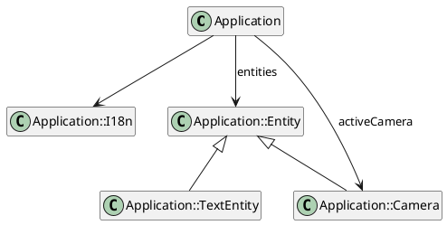

# MonoClass 2

A bunch of discovery on the Java JDK latest release into a fun and entertaining sample of code. Let's discover the
JEP420 Pattern Matching `switch`, `@FunctionalInterface` and some enhancement on the
`[List/Map].of()` constructors.

## The project

The [`Application`](https://github.com/mcgivrer/monoclass2/blob/feature/add-camera-entity/src/main/java/com/demoing/app/Application.java#L17)
class (we can not talk about a project for a 500 LoCs class) is composed of some attribtues and methods (sic) and a
limited number of subclasses.

_figure 1 - Class Diagram for Application and its
subclasses_ _[edit](https://github.com/mcgivrer/monoclass2/blob/feature/add-camera-entity/docs/class-diagram.txt)_

So, [`I18n`](https://github.com/mcgivrer/monoclass2/blob/feature/add-camera-entity/src/main/java/com/demoing/app/Application.java#L69)
, `Entity`, `TextEntity` and `Camera` are subclasses of `Application` master class, if you does not understand :P.

### A master Application

The main class (and the jar entrypoint) is composed of some feature centric attributes like:

- `entites` which is a map of `Entity` managed by the program,
- `gPipeline` is the list of entities to be rendered to screen.
- `activeCamera` is the possible `Camera` to see through to focus a specific target `Entity`.

A bunch of methods are for internal initialization and processing only:

- `initialize()`, `loadConfig()`, `parseArg()`, `parseDouble()`, `parseInt()` to start the app, load configuration and
  parse agrs
- `run()`, `loop()`, `update()`, to execute the main loop,
- `updateEntity`, `applyPhysicRuleToEntity`, `ContrainEntity()`, `constrainToWorld()` to update and compute entities
  moves, physics and constrains,
- `draw()`, `renderToScreen()`,`moveCamera()` to process rendering pipeline.

And some methods that can be adapted:

- `loadConfig()` to define some configuratble parameters from the `app.propertties` file,
- `parseArg()` to override configuration with CLI arguments values,
- `createScene()` to define the game scene with `Entity` and `Camera`,
- `input()` to process key input for game interaction.

And some utilities / helpers:

- `addEntity()` to add an `Entity` to the application,
- `addCamera()` to define the active Camera, if one must be added (optional).