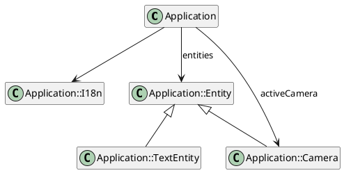

# MonoClass 2

A bunch of discovery on the Java JDK latest release into a fun and entertaining sample of code. Let's discover the
JEP420 Pattern Matching `switch`, `@FunctionalInterface` and some enhancement on the
`[List/Map].of()` constructors.

## The project

The [`Application`](https://github.com/mcgivrer/monoclass2/blob/feature/add-camera-entity/src/main/java/com/demoing/app/Application.java#L17)
class (we can not talk about a project for a 500 LoCs class) is composed of some attribtues and methods (sic) and a
limited number of subclasses.



_figure 1 - Class Diagram for Application and its
subclasses_ _[edit](https://github.com/mcgivrer/monoclass2/blob/feature/add-camera-entity/docs/class-diagram.txt)_

So, [`I18n`](https://github.com/mcgivrer/monoclass2/blob/feature/add-camera-entity/src/main/java/com/demoing/app/Application.java#L69)
, `Entity`, `TextEntity` and `Camera` are subclasses of `Application` master class, if you does not understand :P.

## A master Application

The main class (and the jar entrypoint) is composed of some feature centric attributes like:

- `entites` which is a map of `Entity` managed by the program,
- `gPipeline` is the list of entities to be rendered to screen.
- `activeCamera` is the possible `Camera` to see through to focus a specific target `Entity`.

A bunch of methods are for internal initialization and processing only:

- `initialize()`, `loadConfig()`, `parseArg()`, `parseDouble()`, `parseInt()` to start the app, load configuration and
  parse agrs
- `run()`, `loop()`, `update()`, to execute the main loop,
- `updateEntity`, `applyPhysicRuleToEntity`, `ContrainEntity()`, `constrainToWorld()` to update and compute entities
  moves, physics and constrains,
- `draw()`, `renderToScreen()`,`moveCamera()` to process rendering pipeline.

And some methods that can be adapted:

- `loadConfig()` to define some configuratble parameters from the `app.propertties` file,
- `parseArg()` to override configuration with CLI arguments values,
- `createScene()` to define the game scene with `Entity` and `Camera`,
- `input()` to process key input for game interaction.

And some utilities / helpers:

- `addEntity()` to add an `Entity` to the application,
- `addCamera()` to define the active Camera, if one must be added (optional).

## Delegation pattern

The application based on the one master class, have some sub objects as models, and some as services. To keep it simple
and light, the `Application` class contains the main mechanic. `I18n` provide helpers for translation, while `Entity`,
`Vec2D`, `Camera` are objects to support main activities and are more data oriented.

The configuration operation would be moved to a dedicated object (maybe in a second step), and also the _update_ and
_draw_ operations could be delegated to sub-objects.

```plantuml
@startuml

hide Application methods
hide Application attributes
class Application

hide Entity methods
hide Entity attributes
class Entity

hide Configuration attributes
class Configuration{
 +parseArgs(args:String[])
}
hide Render attributes
class Render{
 +draw(fps:double)
 +addToPipeline(e:Entity)
}
hide PhysicEngine attributes
class PhysicEngine{
 +update(elapsed:double)
}
hide I18n attributes
class I18n{
 + get(key:String)
 + get(key:String,...Object)
}

Application --> Entity:entities
Application --> Configuration:configuration
Application --> Render:render
Application --> PhysicEngine:physicEngine
Application -> I18n
@enduml
```

### Configuration

The `Configuration` class will provide attributes and their default values from a configuration properties file. It is
also possible to parse the command line argument to extract on the fly configuration value to the `Application`.

### Render

All draw operations are delegated to the `Render` class to order, draw and update some pipeline's `Entity` attributes.

### PhysicEngine

The `Application` entities must be updated according to some physic computation formula. This is a job for
the `PhysicEngine`. Some basic physic attributes like elasticity, friction factor are used to compute acceleration,
speed and position according to some applied forces to the `Application` entities.

A small math class is added and is more a helper than a real Vector, the `Vec2d` class, to support needs for forces
computation.


## JDK 17-18 advantages

Mosty in all services and processing class, I'll be using the latest Lambdas possibilities and the JEP-420 preview from
JDK17 and 18, the Pattern Matching Switch Capability, For rendering purpose, adapting the `Render#draw` method the the
type of Entity in the pipeline.

```java
class Render {
    public draw(double fps) {
        gPipeline.stream()
                .filter(e -> e.isAlive() || e.life == -1)
                .forEach(e -> {
                    //...
                    switch (e) {
                        case TextEntity te -> {
                            // draw Text entity
                        }
                        case Entity ee -> {
                            // draw a standard Entity
                        }
                    }
                    //...
                });
    }
}
```

And in the Entity draw operation, the rendering process is adapted to the enum type of Entity:

```java
class Render {
    //...
    public void draw(double fps) {
        //...
        switch (e) {
            //...
            case Entity ee -> {
                // draw a standard Entity
                switch (ee.type) {
                    case RECTANGLE -> {
                        g.fillRect((int) ee.x, (int) ee.y, (int) ee.width, (int) ee.height);
                    }
                    case ELLIPSE -> {
                        g.fillArc((int) ee.x, (int) ee.y, (int) ee.width, (int) ee.height, 0, 360);
                    }
                    case IMAGE -> {
                        g.drawImage(ee.image, (int) ee.x, (int) ee.y, null);
                    }
                }
            }
        }
        //...
    }
    //...
}
```

## Bring Animation

To product beautiful sprite, we need a Animation engine, let's have an Animation class, attribute for Entity, and adapt 
the Render and entity update to process animations set and display a moving Sprite !

Animation is map of set of frames, each set of frame must ave a an easy way to define/identify it, 
a simple String  key will do the job.

>**NOTE**
> _As a sample grpahics, we will use a sprites image board from [Elthen 'adventurer sprites]https://elthen.itch.io/pixel-art-adventurer-sprites thanks to his [fair licensing](https://www.patreon.com/posts/27430241)._


_figure 3 - The sprites resources used as animation sample._

## JMX metrics

It's easy to add remote readable metrics with the builtin Java feature JMX.

First create a simple bean (a MBean in the java jargon) which will contain all the metric you want to expose:

```java
public interface AppStatusMBean {
    // actuators
    Integer getDebugLevel();

    void setDebugLevel(Integer d);

    Boolean getPauseStatus();

    void setPauseStatus(Boolean pause);

    // counters
    Integer getNbEntities();

    Integer getPipelineSize();

    Long getRealFPS();

    // times
    Long getTimeRendering();

    Long getTimeUpdate();
}
```

In this bean exists 3 types of metrics:

- some metrics than can be interactively changed like `debugLevel` and `pauseStatus`,
- some that are simple counters like `nbEntities` or `pipelineSize`,
- and some that are time measures as `timeRendering` or `timeUpdate`  (in nanosecond/ns)

In the Application class, we will have to add a new implementation of this MBean, it must have all the internal
attributes to be exposed:

```java
public class AppStatus implements AppStatusMBean {
    private int debugLevel;
    private int nbEntities, pipelineSize;
    boolean pauseStatus;
    private long realFPS, timeRendering, timeUpdate;
    private String programName;
}
```

And to connect this MBean to the java internal server to expose those values, we will need to register it:

```java
public class AppStatus implements AppStatusMBean {
    //...
    public void register(Application app) {
        try {
            // Register the object in the MBeanServer
            MBeanServer platformMBeanServer = ManagementFactory.getPlatformMBeanServer();
            ObjectName objectName = new ObjectName("com.demoing.app:name=" + programName);
            platformMBeanServer.registerMBean(this, objectName);
        } catch (InstanceAlreadyExistsException
                | MBeanRegistrationException
                | NotCompliantMBeanException
                | MalformedObjectNameException e) {
            e.printStackTrace();
        }
    }
    //...
}
```

And to update this attributes, an update method :

```java
public class AppStatus implements AppStatusMBean {
    //...
    public synchronized void update(Application app) {
        nbEntities = app.entities.size();
        realFPS = app.realFps;
        pipelineSize = app.render.gPipeline.size();
        timeRendering = app.render.renderingTime;
        timeUpdate = app.physicEngine.updateTime;
        pauseStatus = app.pause;
        debugLevel = app.config.debug;
    }
    //...
}
```

And do not forget to add all the needed getters/setters, here are just some examples:

```java
public class AppStatus implements AppStatusMBean {
    //...
    @Override
    public synchronized Integer getDebugLevel() {
        return debugLevel;
    }

    @Override
    public synchronized void setDebugLevel(Integer d) {
        config.debug = d;
    }

    //...
    @Override
    public synchronized Long getTimeRendering() {
        return timeRendering;
    }
    //...
}
```

And in the Application class:

```java
public class Application {
    //...
    private AppStatus appStats;

    //...
    private void initialize(String[] args) {
        //...
        createJMXStatus(this);
    }

    private void createJMXStatus(Application application) {
        appStats = new AppStatus(application, "Application");
        appStats.register(application);
    }

}
```

And now, starting the Application, you can directly connect the JCOnsole to the newly showed java process:


You can accept the insécure connection to the process:


You will get basic informtion for your process:


And finally the created metrics in the MBean tab:


And the debug attribute value can be dynamically changed :


## Dockerize the Desktop java app

_TODO_

https://learnwell.medium.com/how-to-dockerize-a-java-gui-application-bce560abf62a

Prepare a Docker image (see [Dockerfile](../Dockerfile) "open the corresponding docker file")

and build tyhe image:

```shell
docker build --pull --rm -f "Dockerfile" -t monoclass2:latest "."
```

As soon as the docker image is built, you can execute it :

```shell
docker run --rm -it monoclass2:latest
```

## Using ELK to monitor throughJMX

_TODO_

https://medium.com/analytics-vidhya/installing-elk-stack-in-docker-828df335e421

see the [Docker-compose.yaml](./elk/Docker-compose.yaml "Open the docker compose file") file to install ELK through
Docker.

After installing the ELK through a docker-compose recipe, Kibana is reachable at http://localhost:5601

